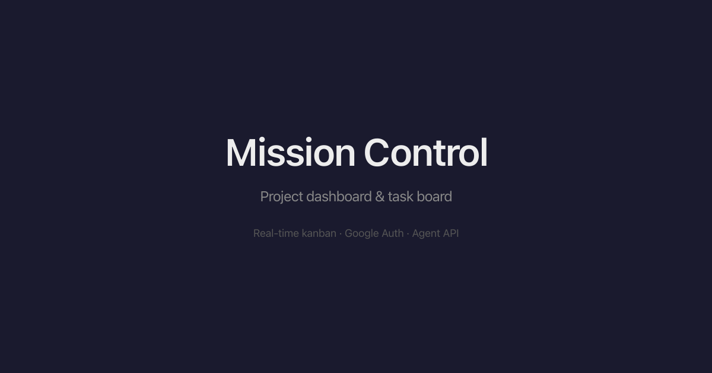
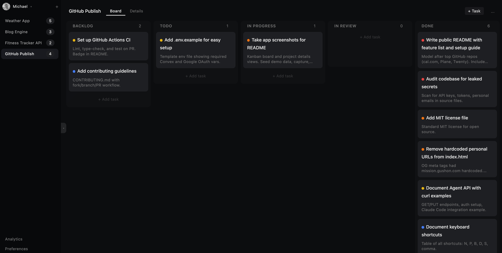

<div align="center">



# Mission Control

**A real-time project dashboard and task board — built for humans and AI agents alike.**

Your projects, your tasks, your kanban board — with an API layer that lets AI agents read and update your work autonomously.

[](https://react.dev) [](https://convex.dev) [](https://www.typescriptlang.org) [](LICENSE)

[Live Demo](https://mission.gushon.com) · [Getting Started](#getting-started) · [Agent API](#agent-api) · [Keyboard Shortcuts](#keyboard-shortcuts)

</div>

---

## What is Mission Control?

Mission Control is a self-hostable project dashboard with a kanban board. It's designed for solo developers and small teams who want a fast, real-time task board — with the unique ability to let AI agents (like Claude, GPT, or custom scripts) read and update tasks through a simple REST API.

Think of it as your personal Jira alternative, minus the bloat, plus an agent API.

<div align="center">
  
  <p><em>Drag-and-drop kanban board with priority indicators</em></p>
</div>

## Features

- **Kanban Board** — Drag-and-drop tasks between columns (Backlog → Todo → In Progress → Done)
- **Real-Time Sync** — Built on Convex, so every change syncs instantly across tabs and devices
- **Project Dashboard** — Manage multiple projects with descriptions, repo links, tech stacks, and notes
- **Agent API** — REST endpoints that let AI agents fetch and update your tasks programmatically
- **Google Auth** — Sign in with Google, no passwords to manage
- **Custom Columns** — Add your own workflow stages beyond the defaults
- **Priority Levels** — Urgent, High, Medium, Low — color-coded and sortable
- **Keyboard Shortcuts** — Navigate your board without touching the mouse
- **i18n** — English and Hebrew with full RTL support
- **Mobile Friendly** — Responsive layout that works on any screen size

## Tech Stack

| Layer | Technology |
|-------|-----------|
| Frontend | React 19, TypeScript, Tailwind CSS 4 |
| Backend | [Convex](https://convex.dev) (real-time serverless) |
| Auth | Google OAuth via Convex Auth |
| Drag & Drop | dnd-kit |
| UI | shadcn/ui components, Lucide icons |
| Build | Vite 8 |

## Getting Started

### Prerequisites

- [Node.js](https://nodejs.org) 18+
- A [Convex](https://convex.dev) account (free tier available)
- A [Google Cloud](https://console.cloud.google.com) project with OAuth credentials

### 1. Clone and install

```bash
git clone https://github.com/Michael-Schwartz-is/mission-control.git
cd mission-control
npm install
```

### 2. Set up Convex

```bash
npx convex dev
```

This will prompt you to create a new Convex project (or link an existing one). It starts the backend and watches for changes.

### 3. Configure Google OAuth

1. Go to [Google Cloud Console](https://console.cloud.google.com/apis/credentials)
2. Create an OAuth 2.0 Client ID (Web application type)
3. Set the authorized redirect URI to: `https://YOUR_CONVEX_DEPLOYMENT.convex.site/api/auth/callback/google`
4. Copy your Client ID and Client Secret

Then set them as Convex environment variables:

```bash
npx convex env set AUTH_GOOGLE_ID your-google-client-id
npx convex env set AUTH_GOOGLE_SECRET your-google-client-secret
```

### 4. Start the frontend

In a second terminal:

```bash
npm run dev
```

Open [http://localhost:5173](http://localhost:5173) and sign in with Google.

## Keyboard Shortcuts

| Key | Action |
|-----|--------|
| <kbd>N</kbd> | New task |
| <kbd>P</kbd> | New project |
| <kbd>B</kbd> | Switch to Board view |
| <kbd>D</kbd> | Switch to Details view |
| <kbd>S</kbd> | Toggle sidebar |
| <kbd>,</kbd> | Open settings |

Shortcuts are automatically disabled when you're typing in an input field.

## Agent API

The killer feature: AI agents can read and update your tasks through a REST API.

### Setup

1. Open Settings in the app
2. Go to the API Keys section
3. Generate a new key — it starts with `mc_`
4. Store it securely (you won't see it again)

### Endpoints

**Base URL:** `https://YOUR_DEPLOYMENT.convex.site`

#### `GET /api/data` — Fetch all your data

```bash
curl -H "Authorization: Bearer mc_YOUR_KEY" \
  https://YOUR_DEPLOYMENT.convex.site/api/data
```

Returns:

```json
{
  "global": { "key": "value" },
  "columns": [
    { "id": "backlog", "label": "Backlog" },
    { "id": "todo", "label": "Todo" },
    { "id": "in-progress", "label": "In Progress" },
    { "id": "done", "label": "Done" }
  ],
  "projects": [
    {
      "id": "my-project",
      "name": "My Project",
      "description": "Project description",
      "repo": "https://github.com/...",
      "stack": "React, Convex",
      "context": "Architecture notes for agents...",
      "status": "active",
      "tasks": [
        {
          "id": "abc-123",
          "title": "Fix login bug",
          "description": "Details here",
          "status": "in-progress",
          "priority": "high",
          "createdAt": "2025-01-15T10:00:00.000Z"
        }
      ]
    }
  ]
}
```

#### `PUT /api/data` — Update everything

```bash
curl -X PUT \
  -H "Authorization: Bearer mc_YOUR_KEY" \
  -H "Content-Type: application/json" \
  -d @data.json \
  https://YOUR_DEPLOYMENT.convex.site/api/data
```

Send the same structure as the GET response. This replaces all your data — projects, tasks, columns, and global context.

### Example: Claude Code Integration

Add this to your Claude Code instructions (e.g., `CLAUDE.md`) and any AI agent can read your tasks before starting work and mark them as done when finished:

```bash
# Fetch tasks
curl -s "$MISSION_CONTROL_API_URL/api/data" \
  -H "Authorization: Bearer $MISSION_CONTROL_API_KEY" | python3 -c "
import sys, json
d = json.load(sys.stdin)
for p in d['projects']:
    print(f'\n=== {p[\"name\"]} ===')
    for t in p['tasks']:
        if t['status'] != 'done':
            print(f'  [{t[\"status\"]}] {t[\"title\"]}')"
```

```bash
# Mark a task as done
curl -s "$MISSION_CONTROL_API_URL/api/data" \
  -H "Authorization: Bearer $MISSION_CONTROL_API_KEY" | \
  python3 -c "
import sys, json
d = json.load(sys.stdin)
for p in d['projects']:
    for t in p['tasks']:
        if t['id'] == 'TASK_ID_HERE':
            t['status'] = 'done'
print(json.dumps(d))" | \
  curl -s -X PUT "$MISSION_CONTROL_API_URL/api/data" \
    -H "Authorization: Bearer $MISSION_CONTROL_API_KEY" \
    -H "Content-Type: application/json" -d @-
```

### Global Context

The Settings panel has a "Global Context" section — a key-value store that agents can read. Use it to share API endpoints, documentation links, or architecture notes that your agents need.

## Project Structure

```
convex/                 # Backend (Convex serverless functions)
  schema.ts             # Database schema
  auth.ts               # Google OAuth config
  http.ts               # HTTP API routes
  projects.ts           # Project queries & mutations
  tasks.ts              # Task mutations
  columns.ts            # Column management
  data.ts               # Bulk data get/import for agent API
  apiKeys.ts            # API key management
  globalContext.ts       # Global context store

src/                    # Frontend (React + TypeScript)
  App.tsx               # Main layout
  components/
    LoginPage.tsx       # Google sign-in
    Sidebar.tsx         # Project list & navigation
    KanbanBoard.tsx     # Drag-and-drop board
    KanbanColumn.tsx    # Individual column
    TaskCard.tsx        # Task card component
    TaskDialog.tsx      # Create/edit task modal
    ProjectContext.tsx  # Project details panel
    SettingsDialog.tsx  # Settings & API keys
```

## Deployment

### Frontend

Build the static frontend and deploy to any hosting provider (Vercel, Netlify, Cloudflare Pages, etc.):

```bash
npm run build
```

The output is in the `dist/` folder.

### Backend

Convex handles backend deployment automatically. When you run `npx convex deploy`, your functions are deployed to Convex's cloud infrastructure. No servers to manage.

```bash
npx convex deploy
```

## Contributing

Contributions are welcome! Feel free to open issues or submit pull requests.

1. Fork the repo
2. Create your branch (`git checkout -b feature/my-feature`)
3. Commit your changes
4. Push to the branch (`git push origin feature/my-feature`)
5. Open a Pull Request

## License

MIT — see [LICENSE](LICENSE) for details.

---

<div align="center">

Built with [Convex](https://convex.dev) and [React](https://react.dev)

</div>
